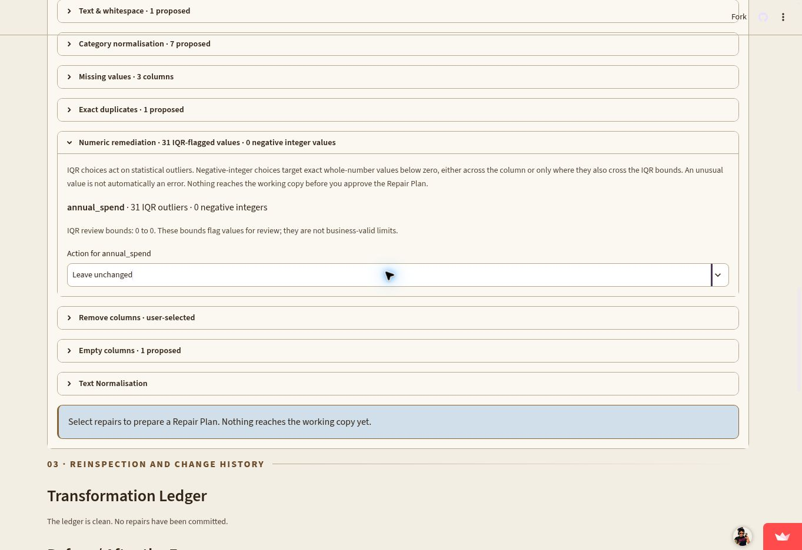
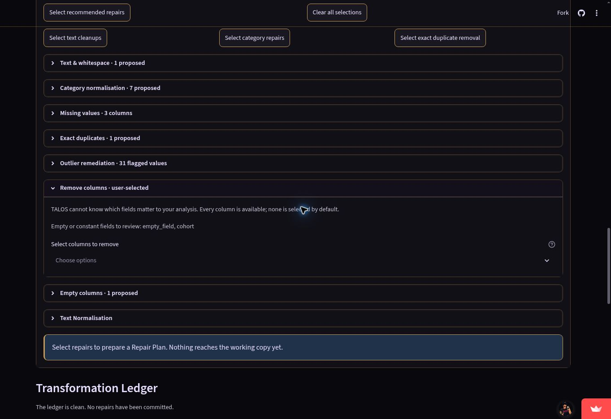
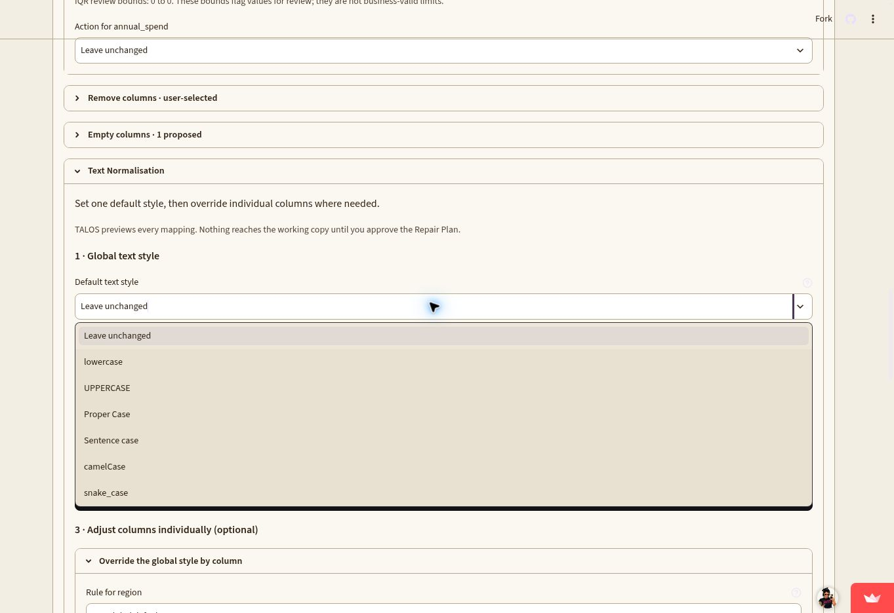
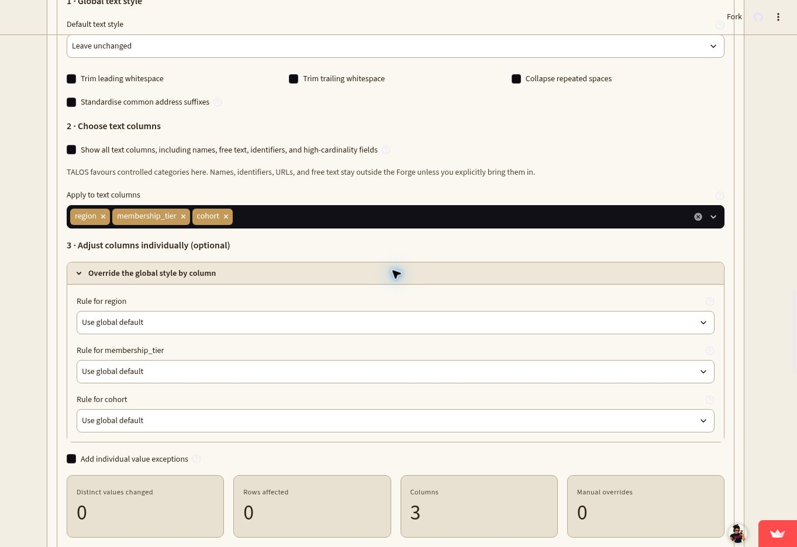
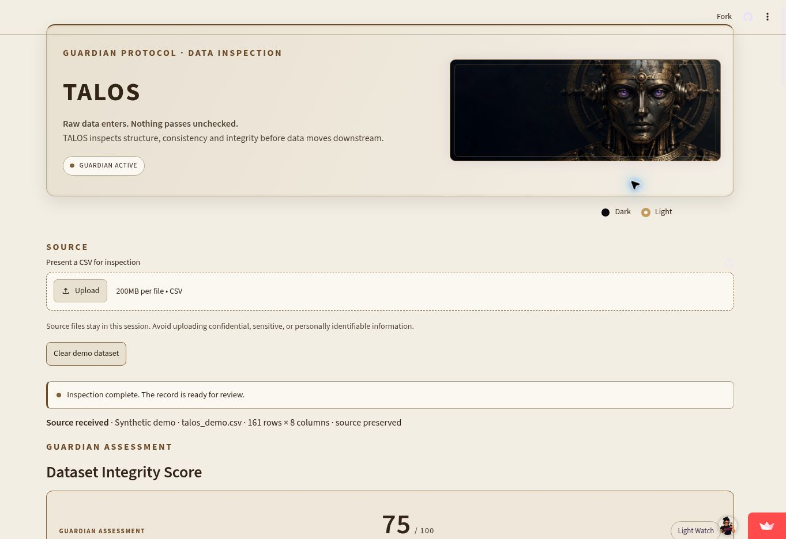

# TALOS

**Raw data enters. Nothing passes unchecked.**

**Current release: v1.1.2 — Streamlit readability, Forge controls, and text normalisation.**

This patch follows v1.1.1 and continues the published version sequence.

[Open the live Streamlit app](https://talos-app.streamlit.app/) · [View the source](https://github.com/Jesi-Jemison/TALOS)

Release notes: [CHANGELOG.md](CHANGELOG.md).

TALOS is a Python data-inspection application inspired by the bronze automaton guardian of Greek mythology. It profiles a CSV, explains quality signals, and lets a person prepare and approve repairs to a separate working copy. The uploaded source stays untouched.

## Try the demo

Open the [live app](https://talos-app.streamlit.app/) and choose **Load TALOS demo dataset**. The deterministic, synthetic dataset includes missing values, exact duplicates, category variants, an IQR outlier, repeated identifier values, empty and constant columns, and a zero-heavy measure. No real personal information is used.

## TALOS in action

Screenshots use the built-in synthetic demo data.











The appearance preference is session-level and leaves the inspection state intact.



## What it does

- Reads and profiles CSV files, then previews the source structure and records.
- Inspects missingness, exact duplicate rows, category variation, IQR outliers, possible identifiers, empty and constant columns, high-cardinality text, and numeric patterns.
- Calculates an explainable, custom **Dataset Integrity Score** with visible components and weights.
- Offers granular, user-selected repairs in **The Forge**. Each selection becomes a previewable Repair Plan before anything is applied.
- Lets users remove selected fields and choose an IQR response per numeric column: leave unchanged, blank, non-outlier mean or median, custom value, remove affected rows, or cap to the nearest IQR boundary. Numeric remediation can also target all negative whole-number values or only negative whole-number IQR outliers.
- Applies a global text style with per-column overrides, including Proper Case, Sentence case, camelCase, upper/lowercase, and optional address-suffix standardisation such as Road/Rd and Street/St.
- Reinspects the working copy after approval, compares it with the source, and records each operation in a transformation ledger.
- Keeps the PDF concise and aggregate-focused; detailed row evidence remains available in the HTML report, CSV exports, and ZIP Evidence Pack.
- Provides session-level dark and light themes with readable alerts, tables, captions, and expandable sections.

## The workflow

```text
INGEST → INSPECT → UNDERSTAND → SELECT → PREVIEW → REPAIR
       → REINSPECT → COMPARE → EXPORT → DOCUMENT
```

`original_df` is retained for reference and reset. `working_df` starts as a deep copy and is replaced only after an approved plan succeeds. Original and working-copy findings are kept separately; the ledger records actions, parameters, row and column counts, and representative before/after values. Reset restores a fresh copy of the source.

TALOS does not treat a signal as proof of an error. An outlier can be valid; identifier uniqueness depends on context; repeated keys, constant columns, and negative or zero-heavy values may be intentional. No transformation is applied silently.

## Dataset Integrity Score

The score is a **custom TALOS heuristic**, not an industry standard or a guarantee that data is correct. It summarises only the checks TALOS currently implements.

| Component | Weight |
| --- | ---: |
| Completeness | 30% |
| Exact duplicate rows | 20% |
| Category consistency | 15% |
| Structural health | 20% |
| IQR outlier signal | 15% |

The score breakdown, methodology, exclusions, and limitations are in [the scoring notes](docs/scoring_methodology.md). After a repair, TALOS shows component and finding changes while reminding users that a higher score does not establish suitability.

The local synthetic performance check and its limits are documented in [performance notes](docs/performance_notes.md).

## Architecture

```text
                         shared TALOS core
                  ┌────────────────────────┐
                  │ profile and inspections│
                  │ score and transforms   │
                  │ reports and evidence   │
                  └───────────┬────────────┘
                              │
              ┌───────────────┼──────────────┐
              │               │              │
          Streamlit       Python API        CLI
           app.py         src/workflow.py   talos_cli.py
                         scripts/notebooks
                         VS Code example
```

TALOS uses one reusable Python core across its web, scripting, and command-line
interfaces. The shared inspection entry point is `src.workflow.inspect_dataset`;
`app.py` calls it, so quality rules and score calculations are not duplicated.
Core modules do not depend on Streamlit or session state.

| Core module | Responsibility |
| --- | --- |
| `profiler.py` | CSV intake, type identification, and dataset profile |
| `quality_checks.py` | Read-only pandas inspections |
| `scoring.py` | Explainable weighted integrity score |
| `transformations.py` | Copy-returning repairs, plan estimates, and ledger records |
| `evidence.py` | Portable finding tables and ZIP pack assembly |
| `reporting.py` | CSV serialization and self-contained HTML/PDF reports |
| `workflow.py` | Shared inspection/summary functions and `TalosSession` orchestration |
| `theme.py` | Streamlit dark/light colour tokens |

## Run locally

Use Python 3.10 or newer. Clone the repository, create an isolated environment,
install the Streamlit requirements, and launch the app from the repository
root:

```bash
git clone https://github.com/Jesi-Jemison/TALOS.git
cd TALOS
python -m venv .venv
```

Activate the environment in your terminal:

```bash
# macOS or Linux
source .venv/bin/activate
```

```powershell
# Windows PowerShell
.venv\Scripts\Activate.ps1
```

```bat
:: Windows Command Prompt
.venv\Scripts\activate.bat
```

Then install dependencies and launch TALOS:

```bash
python -m pip install --upgrade pip
python -m pip install -r requirements.txt
streamlit run app.py
```

The first command installs the packages TALOS needs to run the Streamlit
product. The final command must run from the cloned `TALOS` directory, where
`app.py` lives. Streamlit prints a local URL and a network URL; use the local
URL on the same computer where you started the server.

If the `streamlit` command is not on PATH after activation, use
`python -m streamlit run app.py`. Open the local URL printed in the terminal,
usually `http://localhost:8501`. Choose **Load TALOS demo dataset** to explore
the inspection and Forge, or upload a UTF-8 CSV. Uploaded files remain in the
active app session; TALOS does not write the original CSV back to disk. Stop
the server with **Ctrl+C** in its terminal. To use another port, run
`python -m streamlit run app.py --server.port 8502`.

For a fresh session, choose **Clear demo dataset** before uploading a file.
The demo is synthetic and can be used to walk through inspection, repair
selection, approval, reinspection, and exports without preparing a CSV first.

To restart later, open a terminal in the repository, activate `.venv` using
the command for your operating system above, and run the Streamlit command
again. If installation fails, confirm the environment is active with
`python --version` and `python -m pip --version` before reinstalling.

To run the complete tests, install the test-only PDF reader and run pytest:

```bash
python -m pip install -r requirements-test.txt
python -m pytest -q
```

## Use TALOS

### Browser

Open the [live Streamlit app](https://talos-app.streamlit.app/) to inspect a
dataset interactively.

### Python

Install standalone dependencies and use the API from a script or notebook:

```bash
python -m pip install -r requirements-core.txt
```

```python
from src.workflow import TalosSession

talos = TalosSession.from_csv("my_data.csv")
talos.inspect()
print(talos.summary())
print(talos.original_findings["missing"])
```

For a full, commented example that previews and applies a repair, compares
findings, exports reports, and resets the working copy, open
[`examples/vscode_workflow.py`](examples/vscode_workflow.py). The
[VS Code setup guide](docs/vscode_usage.md) includes environment and path steps.

### Command line

Install `requirements-core.txt`, then print an inspection summary:

```bash
python talos_cli.py inspect my_data.csv
```

Write reports, finding tables, and an evidence pack:

```bash
python talos_cli.py inspect my_data.csv --output output/talos
```

The CLI is read only: preview and apply transformations from Python with
`TalosSession.preview(...)` and `TalosSession.apply(...)`.

## Privacy and limitations

Uploaded CSV bytes, source and working DataFrames, findings, report HTML, and ledger are held in the active Streamlit session. TALOS does not intentionally save uploaded data to persistent storage, use a database, create user accounts, or send telemetry. Avoid uploading confidential, sensitive, or personally identifiable information.

TALOS reads CSV files only. Its rules do not infer business context, enforce a schema, or prove that a dataset is ready for a specific decision. Missing-value strategies and category mappings require a user's choice. The HTML report is self-contained; PDF generation uses ReportLab.

## Project status

The Streamlit product and the separately released Python/CLI interfaces are
implemented. This v1.1.2 update strengthens light-mode control contrast and
section flow, adds negative-integer remediation choices, and makes global,
per-column, and address-suffix text normalisation easier to use. TALOS remains
a review-first workflow and does not infer business meaning or certify that a
dataset is ready for analysis.
