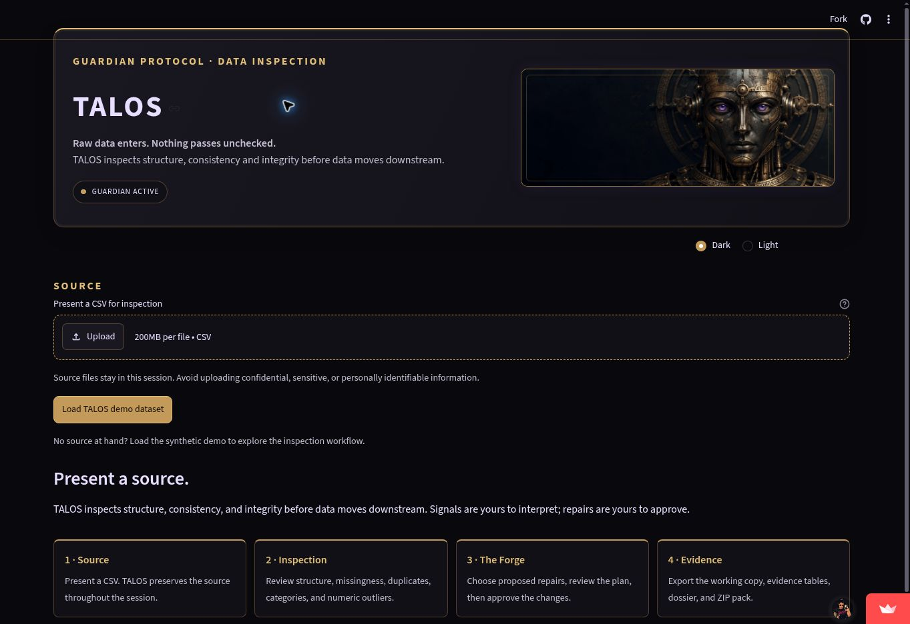
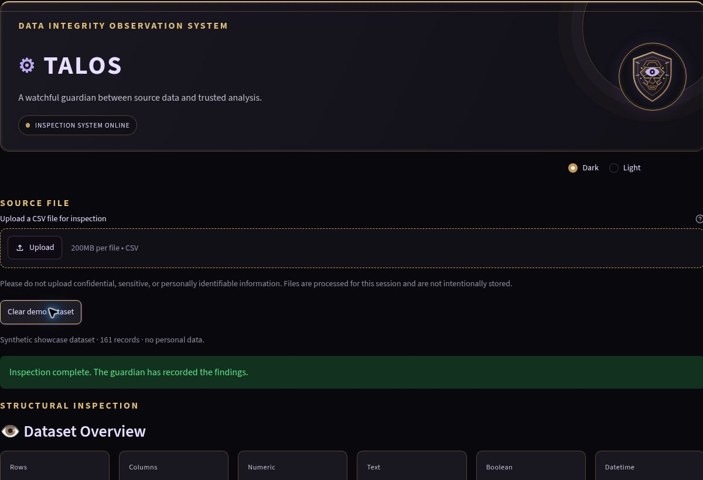
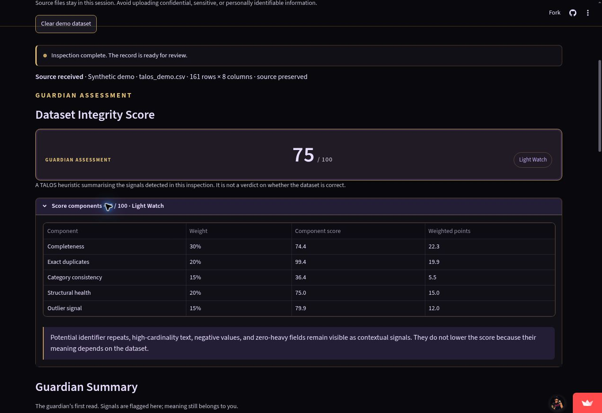
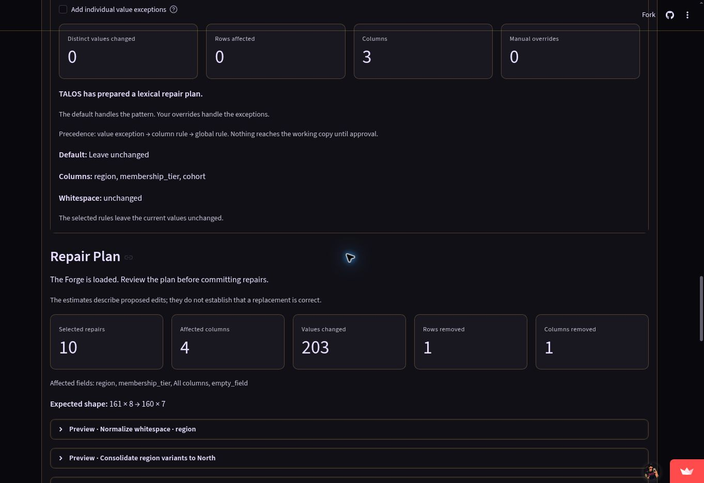
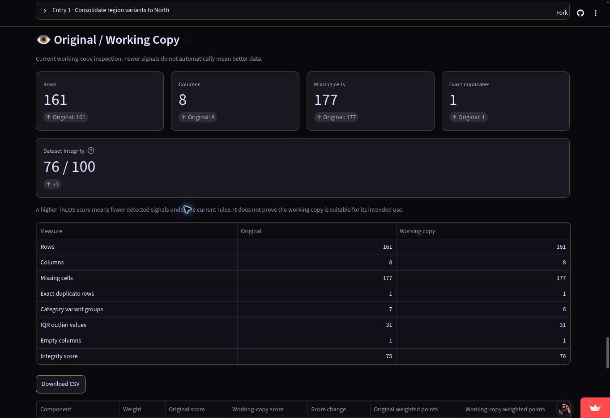
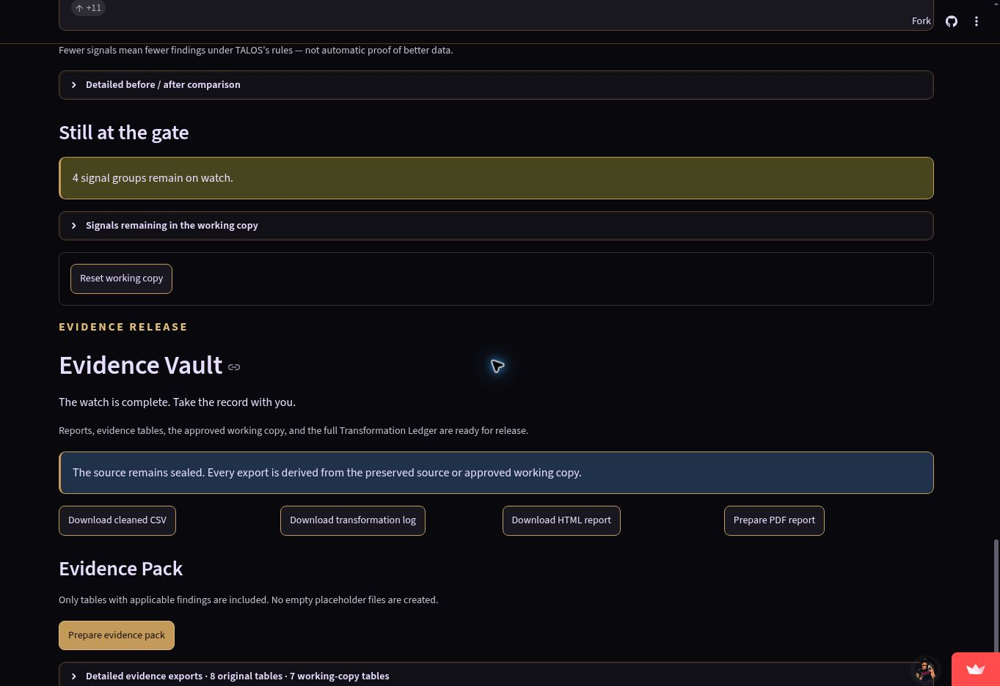
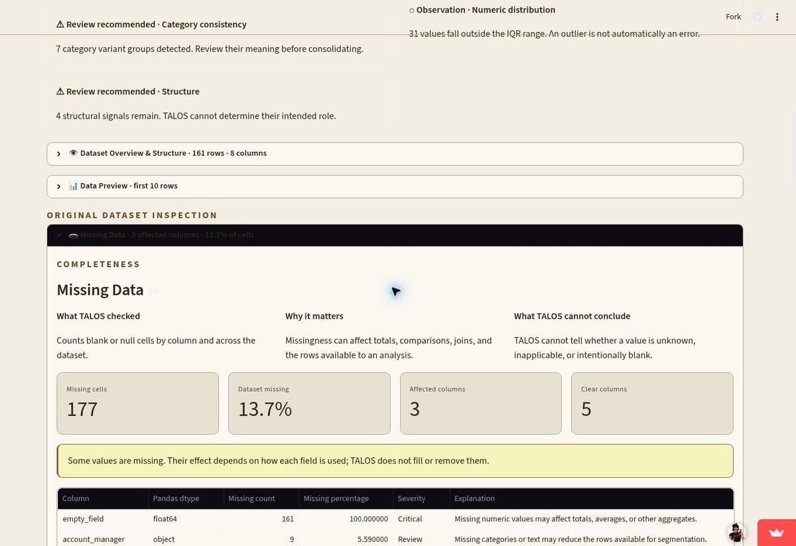

# TALOS

**A watchful guardian that inspects data before it is trusted.**

[Open the live Streamlit app](https://talos-app.streamlit.app/) · [View the source](https://github.com/Jesi-Jemison/TALOS)

TALOS is a Python data-inspection application inspired by the bronze automaton guardian of Greek mythology. It profiles a CSV, explains quality signals, and lets a person prepare and approve repairs to a separate working copy. The uploaded source stays untouched.

## Try the demo

Open the [live app](https://talos-app.streamlit.app/) and choose **Load TALOS demo dataset**. The deterministic, synthetic dataset includes missing values, exact duplicates, category variants, an IQR outlier, repeated identifier values, empty and constant columns, and a zero-heavy measure. No real personal information is used.

## TALOS in action

Screenshots use the built-in synthetic demo data.







| The Forge | Reinspection |
| --- | --- |
|  |  |



The appearance preference is session-level and leaves the inspection state intact.



## What it does

- Reads and profiles CSV files, then previews the source structure and records.
- Inspects missingness, exact duplicate rows, category variation, IQR outliers, possible identifiers, empty and constant columns, high-cardinality text, and numeric patterns.
- Calculates an explainable, custom **Dataset Integrity Score** with visible components and weights.
- Offers granular, user-selected repairs in **The Forge**. Each selection becomes a previewable Repair Plan before anything is applied.
- Reinspects the working copy after approval, compares it with the source, and records each operation in a transformation ledger.
- Exports result tables as CSV, a cleaned working copy, the ledger, a printable HTML dossier, and a ZIP evidence pack.
- Provides session-level dark and light themes.

## The workflow

```text
INGEST → INSPECT → UNDERSTAND → SELECT → PREVIEW → REPAIR
       → REINSPECT → COMPARE → EXPORT → DOCUMENT
```

`original_df` is retained for reference and reset. `working_df` starts as a deep copy and is replaced only after an approved plan succeeds. Original and working-copy findings are kept separately; the ledger records actions, parameters, row and column counts, and representative before/after values. Reset restores a fresh copy of the source.

TALOS does not treat a signal as proof of an error. An outlier can be valid; identifier uniqueness depends on context; repeated keys, constant columns, and negative or zero-heavy values may be intentional. No transformation is applied silently.

## Dataset Integrity Score

The score is a **custom TALOS heuristic**, not an industry standard or a guarantee that data is correct. It summarises only the checks TALOS currently implements.

| Component | Weight |
| --- | ---: |
| Completeness | 30% |
| Exact duplicate rows | 20% |
| Category consistency | 15% |
| Structural health | 20% |
| IQR outlier signal | 15% |

The score breakdown, methodology, exclusions, and limitations are in [the scoring notes](docs/scoring_methodology.md). After a repair, TALOS shows component and finding changes while reminding users that a higher score does not establish suitability.

The local synthetic performance check and its limits are documented in [performance notes](docs/performance_notes.md).

## Architecture

```text
app.py
  Streamlit layout, interaction, session state, and output controls

src/
  profiler.py          CSV intake, type identification, and dataset profile
  quality_checks.py    Read-only pandas inspections
  scoring.py           Transparent weighted integrity score
  transformations.py   Copy-returning repairs, plan estimates, and ledger records
  evidence.py          Portable findings tables and ZIP pack assembly
  reporting.py         CSV serialization and self-contained HTML report
  theme.py             Dark/light colour tokens

assets/                TALOS CSS, emblem, and demo screenshots
data/sample/           Synthetic showcase CSV
docs/                  Scoring, performance, and portfolio notes
tests/                 Unit and Streamlit flow tests
```

The analysis is implemented directly with Python, pandas, and NumPy. TALOS does not use a third-party profiling or data-validation framework.

## Run locally

```bash
git clone https://github.com/Jesi-Jemison/TALOS.git
cd TALOS
python -m venv .venv
source .venv/bin/activate  # Windows: .venv\Scripts\activate
pip install -r requirements.txt
streamlit run app.py
```

Run the test suite with:

```bash
python -m pytest -q
```

## Privacy and limitations

Uploaded CSV bytes, source and working DataFrames, findings, report HTML, and ledger are held in the active Streamlit session. TALOS does not intentionally save uploaded data to persistent storage, use a database, create user accounts, or send telemetry. Avoid uploading confidential, sensitive, or personally identifiable information.

TALOS reads CSV files only. Its rules do not infer business context, enforce a schema, or prove that a dataset is ready for a specific decision. Missing-value strategies and category mappings require a user's choice. PDF export is not included; the self-contained HTML report is the printable canonical report.

## Project status

Stages 1–15 are implemented: intake, profiling, inspection, scoring, controlled repair, reinspection, evidence export, theme preferences, and showcase mode. The focus is a clear, testable portfolio example of pandas analysis and responsible data-cleaning workflow.
